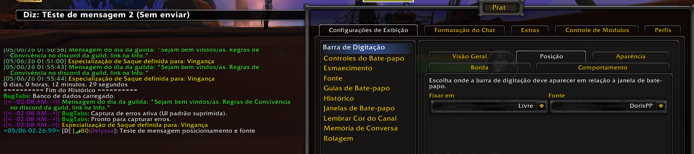
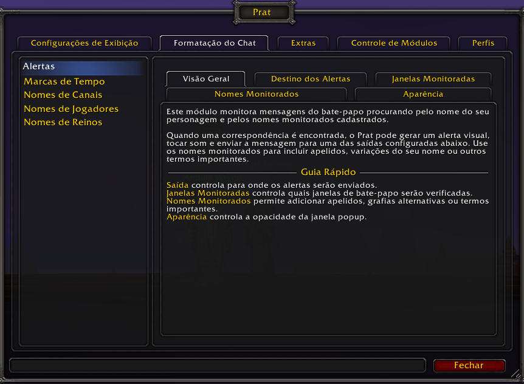
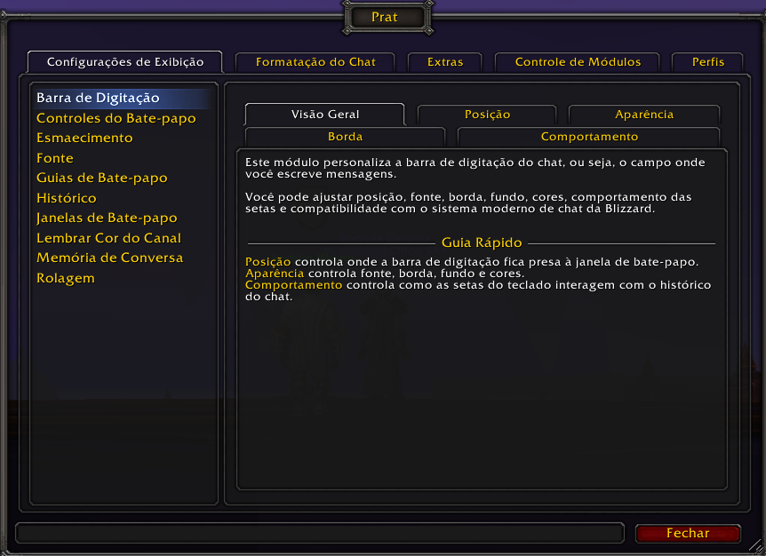
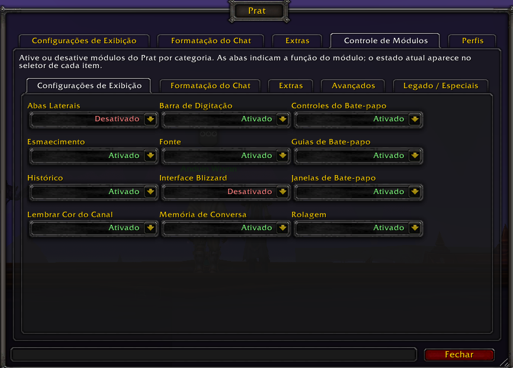
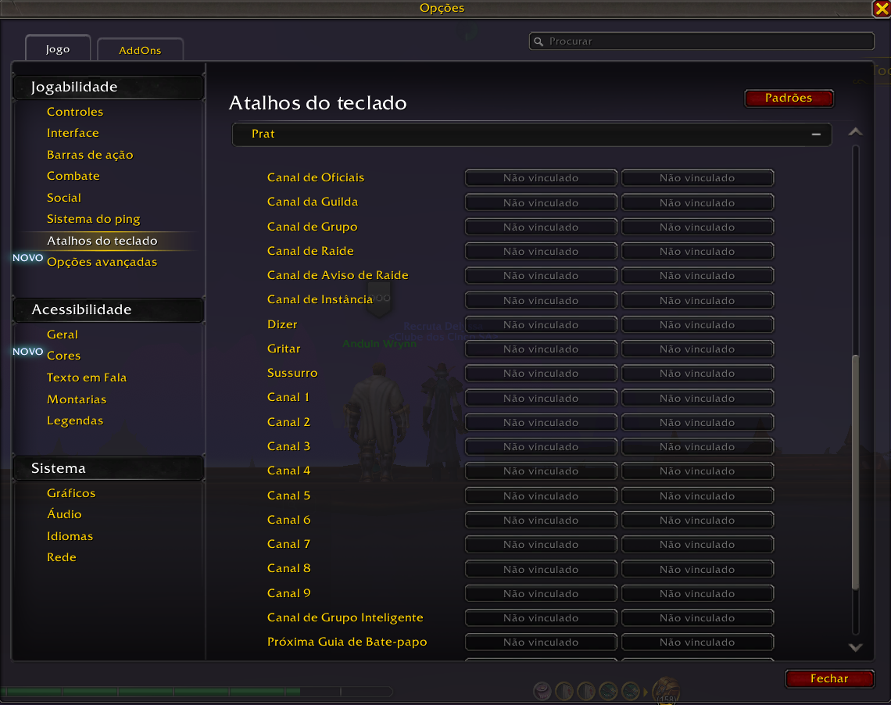
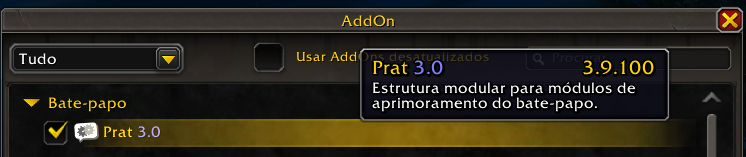
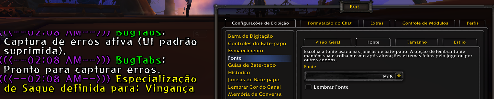

<a id="top"></a>

# Prat-3.0

### Fork multilíngue com localização revisada, polimento de interface e organização modular

<p align="center">
  <strong>🌐 Idiomas disponíveis</strong><br><br>
  
  <strong>Português (Brasil)</strong>
  &nbsp;&nbsp;|&nbsp;&nbsp;
  <a href="docs/readme/enUS.md">
    
    <strong>English</strong>
  </a>
</p>

---

## Sobre este fork

Este repositório é um fork modificado do **Prat-3.0**, um addon clássico de aprimoramento do bate-papo para **World of Warcraft**.

O projeto original foi desenvolvido por **Sylvanaar** e colaboradores, e continua sendo a base técnica e histórica deste trabalho.

**Projeto original:**  
https://github.com/sylvanaar/prat-3-0

Este fork nasceu com foco inicial em localização `ptBR`, mas acabou indo além de uma simples tradução. Durante o processo, várias partes da interface de configuração foram revisadas, descrições foram reescritas, opções foram reorganizadas e a estrutura de localização foi separada em arquivos próprios para facilitar manutenção e expansão futuras.

A proposta não é substituir o Prat-3.0 original, nem apresentar este fork como uma reescrita completa do addon. A base modular, a lógica principal e a identidade do projeto original continuam preservadas.

O foco deste fork está em:

- tornar o addon mais claro e compreensível para os jogadores;
- centralizar e organizar os arquivos de localização;
- melhorar textos, nomes, descrições e dicas;
- reorganizar opções de alguns módulos em grupos ou abas;
- corrigir inconsistências encontradas durante o processo de revisão;
- preparar uma base mais amigável para futuras traduções;
- preservar o comportamento original sempre que possível.

Em resumo: este é um fork de **localização, organização, manutenção e polimento de interface**, com modificações pontuais em módulos específicos.

---

## 🖼️ Galeria visual

As imagens abaixo demonstram a interface localizada, a reorganização das opções e alguns dos recursos visuais funcionando diretamente no jogo.

### Personalização do chat, fontes e marcas de tempo

<p align="center">
  
</p>

### Interface localizada

<table>
<tr>
<td width="50%" align="center">

<strong>Alertas e nomes monitorados</strong>



</td>
<td width="50%" align="center">

<strong>Barra de digitação</strong>



</td>
</tr>
</table>

<details>
<summary><strong>📷 Clique para abrir a galeria adicional em ptBR</strong></summary>

<br>

### Controle de módulos

<p align="center">
  
</p>

### Atalhos do teclado

<p align="center">
  
</p>

### Lista de AddOns e versão instalada

<p align="center">
  
</p>

### Variação de fonte e marcas de tempo

<p align="center">
  
</p>

</details>

---

## Escopo das modificações

As alterações deste fork não se limitam a traduzir textos.

O trabalho envolveu principalmente:

- criação de uma estrutura centralizada de localização;
- consolidação de `enUS` como idioma-base e fallback;
- criação e revisão do `ptBR`;
- reorganização de blocos de idioma por módulo;
- revisão de nomenclaturas exibidas ao jogador;
- adaptação de textos para linguagem natural em português brasileiro;
- ajustes em descrições, dicas e mensagens da interface;
- reorganização visual de opções em módulos selecionados;
- separação de opções por grupos ou abas quando isso melhorava a clareza;
- preservação da lógica original nos pontos sensíveis do addon.

Alguns módulos receberam apenas revisão textual ou localização. Outros tiveram reorganização de interface ou melhorias pontuais mais perceptíveis.

---

## Estrutura de localização

Este fork organiza a localização em arquivos dedicados, separando o idioma-base das traduções.

Arquivos principais:

```text
locales/enUS.lua
locales/ptBR.lua
locales/includes.xml
```

O idioma `enUS` funciona como base e fallback principal.

O idioma `ptBR` é a primeira localização completa e revisada deste fork.

A estrutura foi pensada para facilitar manutenção futura e permitir expansão gradual para outros idiomas.

Ordem planejada dos idiomas:

```text
enUS - Inglês dos Estados Unidos / idioma-base e fallback
ptBR - Português do Brasil
ptPT - Português Europeu
esES - Espanhol Europeu
esMX - Espanhol Latino-americano
frFR - Francês
itIT - Italiano
deDE - Alemão
ruRU - Russo
koKR - Coreano
zhCN - Chinês Simplificado
zhTW - Chinês Tradicional
```

Nem todos esses idiomas estão disponíveis no momento. A lista acima representa a ordem planejada para expansão futura.

---

## Áreas e módulos revisados

O Prat-3.0 é altamente modular. Este fork trabalhou principalmente em revisão textual, localização, organização de opções e clareza visual em vários módulos e áreas do addon.

As mudanças variam conforme o módulo: alguns receberam apenas revisão de textos e nomenclaturas; outros tiveram opções reorganizadas em grupos, abas ou descrições mais claras.

| Área | Módulos envolvidos |
|---|---|
| Interface, aparência e janelas | `Bubbles`, `ChatFrames / Frames`, `ChatTabs`, `Editbox`, `Fading`, `Font`, `OriginalButtons`, `Paragraph`, `SideTabs` |
| Canais, conversa e histórico | `ChannelColorMemory`, `ChannelNames`, `ChannelSticky`, `ChatLog`, `History`, `Scroll`, `Scrollback`, `Timestamps` |
| Jogadores, nomes e identificação | `AltNames`, `PlayerNames`, `ServerNames` |
| Comandos, atalhos e interação | `Alias`, `Invites`, `KeyBindings`, `PopupMessage` |
| Cópia, busca e links | `CopyChat`, `Search`, `UrlCopy`, `LinkInfoIcons` |
| Filtros, sons e personalização | `Achievements`, `CustomFilters`, `Sounds` |

---

## ✨ Exemplos de ajustes

Alguns exemplos de ajustes realizados dentro da proposta deste fork:

- `Bubbles` recebeu reorganização visual das opções, separando melhor configurações de aparência, conteúdo e comportamento.
- `Achievements` teve sua interface de opções reorganizada para facilitar a leitura e a configuração das mensagens relacionadas a conquistas.
- `Invites` recebeu melhorias pontuais de segurança e controle, como filtro por canais, lista de bloqueio, bloqueio durante combate e cooldown anti-spam.
- `Alias` recebeu um fluxo mais claro para criação de comandos abreviados, incluindo modo assistido, modo avançado e proteção contra conflitos com comandos existentes.
- `UrlCopy` teve suas opções e descrições revisadas para deixar mais claro o comportamento de detecção, exibição e cópia de links.
- `ChannelSticky` teve suas opções reorganizadas para explicar melhor a memorização de tipos de conversa e o comportamento de grupo inteligente.
- `KeyBindings` recebeu revisão de nomenclatura e descrição, deixando mais claro que os atalhos são configurados pelo painel de atalhos do próprio World of Warcraft.
- `SideTabs` passou por revisão de textos visíveis e extração de strings para o sistema de localização.
- Vários módulos tiveram textos internos, descrições, nomes de opções e dicas revisadas para melhorar consistência e manutenção.

*As mudanças variam conforme o módulo. Algumas são apenas textuais ou organizacionais; outras envolvem melhorias pontuais de interface e fluxo de configuração.*

*Também foram adotados cuidados para evitar termos duros, traduções literais demais e textos longos que prejudiquem a leitura dentro da interface do jogo.*

---

## Uso no jogo

Dentro do jogo, digite:

```text
/prat
```

para abrir o menu de configuração do addon.

Após instalar ou atualizar o addon, também é possível recarregar a interface com:

```text
/reload
```

---

## O que este fork NÃO pretende ser

Para manter a proposta honesta, este fork não deve ser entendido como:

- uma reescrita completa do Prat-3.0;
- uma nova versão oficial do addon original;
- uma edição de performance;
- uma promessa de redução de memória ou CPU;
- uma modernização completa do código;
- uma garantia de compatibilidade superior ao projeto original.

Ele é uma versão modificada com foco em **localização**, **UX/UI**, **organização de locales**, **manutenção** e **melhorias pontuais**, respeitando a estrutura original do Prat-3.0.

---

## Créditos

**Prat-3.0** foi originalmente desenvolvido por **Sylvanaar** e colaboradores.

Este fork é baseado no projeto original e busca contribuir com localização revisada, organização de arquivos de idioma e polimento de interface, respeitando a estrutura e a história do addon original.

**Projeto original:**  
https://github.com/sylvanaar/prat-3-0

<p align="right">
  <a href="#top">⬆️ <strong>Voltar ao topo</strong></a>
</p>
