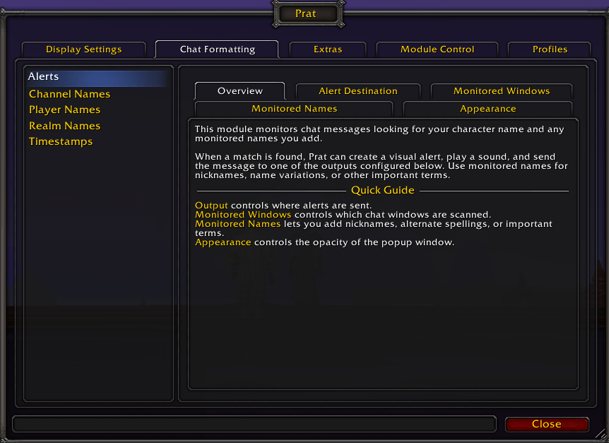
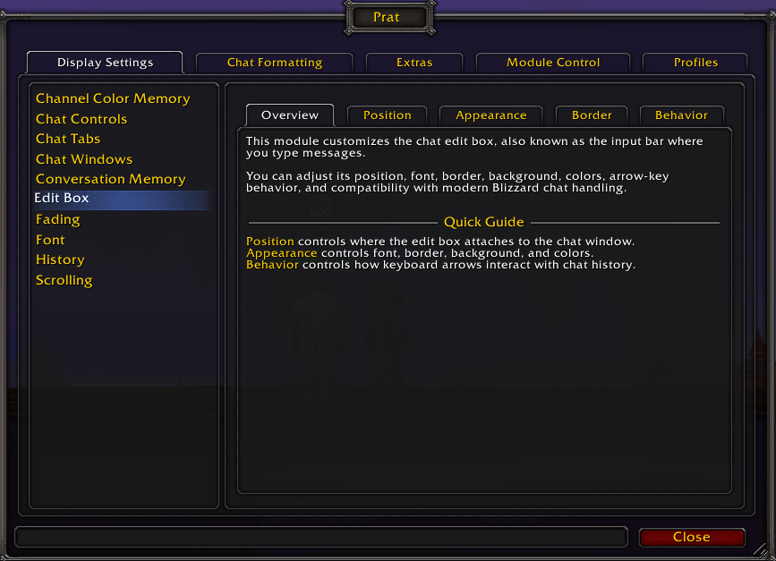
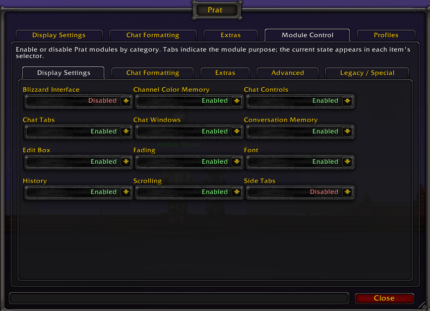
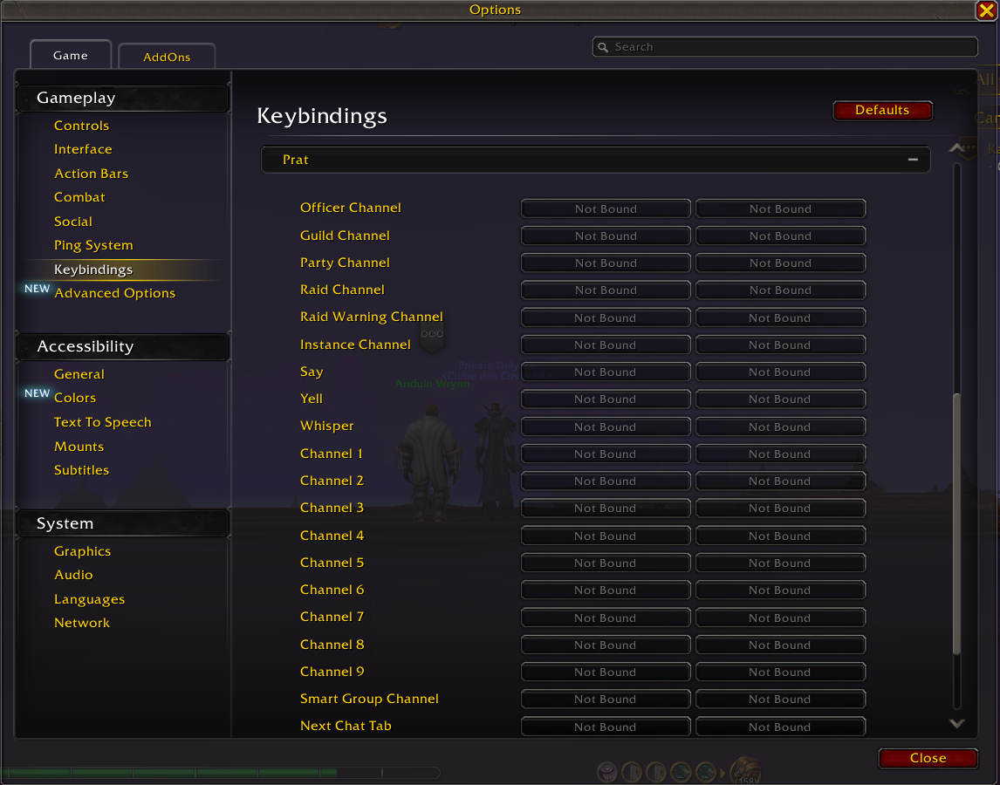
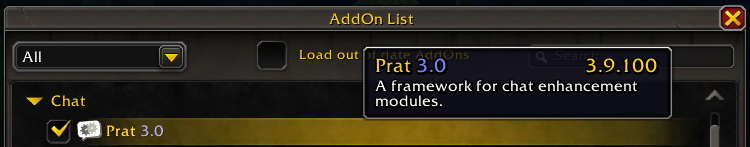
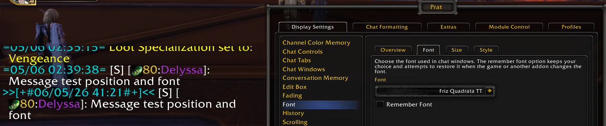

<a id="top"></a>

# Prat-3.0

### Reviewed localization, UI polish and modular organization

<p align="center">
  <strong>🌐 Available languages</strong><br><br>
  <a href="../../README.md">
    
    <strong>Português (Brasil)</strong>
  </a>
  &nbsp;&nbsp;|&nbsp;&nbsp;
  
  <strong>English</strong>
</p>

---

## About this fork

This repository is a modified fork of **Prat-3.0**, a classic chat enhancement addon for **World of Warcraft**.

The original project was developed by **Sylvanaar** and contributors, and remains the technical and historical foundation of this work.

**Original project:**  
https://github.com/sylvanaar/prat-3-0

This fork started with an initial focus on **ptBR localization**, but it became more than a simple translation. During the process, several parts of the configuration interface were reviewed, descriptions were rewritten, options were reorganized, and the localization structure was separated into dedicated files to make future maintenance easier.

The goal is not to replace the original Prat-3.0 project or present this fork as a complete rewrite of the addon. The modular foundation, core logic, and original project identity are still preserved.

This fork focuses on:

- making the addon clearer and easier to understand for players;
- centralizing and organizing localization files;
- improving texts, names, descriptions, and tooltips;
- reorganizing options in selected modules into clearer groups or tabs;
- fixing inconsistencies found during the review process;
- preparing a friendlier base for future translations;
- preserving the original behavior whenever possible.

In short: this is a **localization, organization, maintenance, and UI polish fork**, with selected module-level changes.

---

## 🖼️ Visual gallery

The screenshots below demonstrate the localized interface, reorganized options and selected visual features working directly in-game.

### Chat customization, fonts and timestamps

<p align="center">
  
</p>

### Localized interface

<table>
<tr>
<td width="50%" align="center">

<strong>Alerts and monitored names</strong>



</td>
<td width="50%" align="center">

<strong>Edit box</strong>



</td>
</tr>
</table>

<details>
<summary><strong>📷 Click to open the additional enUS gallery</strong></summary>

<br>

### Module control

<p align="center">
  
</p>

### Keybindings

<p align="center">
  
</p>

### AddOn list and installed version

<p align="center">
  
</p>

### Font and timestamp variation

<p align="center">
  
</p>

</details>

---

## Modification scope

The changes in this fork are not limited to text translation.

The work mainly involved:

- creating a centralized localization structure;
- consolidating `enUS` as the base/fallback language;
- creating and reviewing `ptBR`;
- reorganizing language blocks by module;
- reviewing player-facing naming;
- adapting text into natural Brazilian Portuguese;
- improving descriptions, tooltips, and interface messages;
- visually reorganizing options in selected modules;
- grouping options or using tabs when it improved clarity;
- preserving the original logic in sensitive parts of the addon.

Some modules received only text review or localization. Others received interface reorganization or more noticeable targeted improvements.

---

## Localization structure

This fork organizes localization into dedicated files, separating the base language from translations.

Main files:

```text
locales/enUS.lua
locales/ptBR.lua
locales/includes.xml
```

The `enUS` language works as the main base/fallback.

The `ptBR` language is the initial complete localization of this fork.

The structure was designed to make future maintenance easier and allow gradual expansion to other languages.

Planned language order:

```text
enUS - English (United States) / base and fallback language
ptBR - Brazilian Portuguese
ptPT - European Portuguese
esES - European Spanish
esMX - Latin American Spanish
frFR - French
itIT - Italian
deDE - German
ruRU - Russian
koKR - Korean
zhCN - Simplified Chinese
zhTW - Traditional Chinese
```

Not all of these languages are currently available. The list above represents the planned order for future expansion.

---

## Reviewed areas and modules

Prat-3.0 is highly modular. This fork mainly worked on text review, localization, option organization, and visual clarity across several modules and addon areas.

The scope varies by module: some received only text and naming review, while others had options reorganized into clearer groups, tabs, or descriptions.

| Area | Involved modules |
|---|---|
| Interface, appearance, and windows | `Bubbles`, `ChatFrames / Frames`, `ChatTabs`, `Editbox`, `Fading`, `Font`, `OriginalButtons`, `Paragraph`, `SideTabs` |
| Channels, conversation, and history | `ChannelColorMemory`, `ChannelNames`, `ChannelSticky`, `ChatLog`, `History`, `Scroll`, `Scrollback`, `Timestamps` |
| Players, names, and identification | `AltNames`, `PlayerNames`, `ServerNames` |
| Commands, shortcuts, and interaction | `Alias`, `Invites`, `KeyBindings`, `PopupMessage` |
| Copying, search, and links | `CopyChat`, `Search`, `UrlCopy`, `LinkInfoIcons` |
| Filters, sounds, and customization | `Achievements`, `CustomFilters`, `Sounds` |

---

## ✨ Adjustment examples

Some examples of adjustments made within this fork:

- `Bubbles` received visual option reorganization, better separating appearance, content, and behavior settings.
- `Achievements` had its option interface reorganized to make achievement-related messages easier to read and configure.
- `Invites` received selected safety and control improvements, such as channel filtering, block list, combat blocking, and anti-spam cooldown.
- `Alias` received a clearer flow for creating shortened commands, including assisted mode, advanced mode, and protection against existing command conflicts.
- `UrlCopy` had its options and descriptions reviewed to better explain link detection, display, and copying behavior.
- `ChannelSticky` had its options reorganized to better explain conversation type memory and smart group behavior.
- `KeyBindings` received naming and description review, making it clearer that shortcuts are configured through World of Warcraft's own key bindings panel.
- `SideTabs` received visible text review and string extraction into the localization system.
- Several modules had internal texts, descriptions, option names, and tooltips reviewed to improve consistency and maintenance.

*The scope varies by module. Some changes are only textual or organizational; others involve selected interface and configuration flow improvements.*

*Care was also taken to avoid stiff wording, overly literal translations, and long texts that could hurt readability inside the game interface.*

---

## In-game usage

In game, type:

```text
/prat
```

to open the addon configuration menu.

After installing or updating the addon, you can also reload the interface with:

```text
/reload
```

---

## What this fork is NOT intended to be

To keep the project scope honest, this fork should not be understood as:

- a complete rewrite of Prat-3.0;
- a new official version of the original addon;
- a performance edition;
- a promise of reduced memory or CPU usage;
- a complete code modernization;
- a guarantee of better compatibility than the original project.

It is a modified fork focused on **localization**, **UX/UI**, **locale organization**, **maintenance**, and **selected improvements**, while respecting the original structure of Prat-3.0.

---

## Credits

**Prat-3.0** was originally developed by **Sylvanaar** and contributors.

This fork is based on the original project and aims to contribute reviewed localization, text revision, locale file organization, and UI polish while respecting the structure and history of the original addon.

**Original project:**  
https://github.com/sylvanaar/prat-3-0

<p align="right">
  <a href="#top">⬆️ <strong>Back to top</strong></a>
</p>
