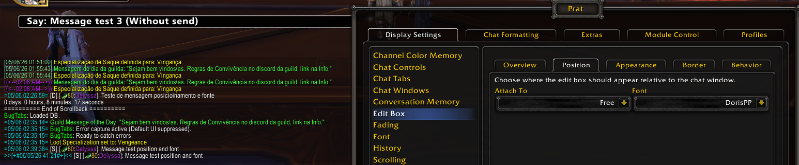

<a id="top"></a>

#  Prat-3.0 3.9.100 — Release notes

<p align="center">
  <strong>🌐 Also available in:</strong><br><br>
  <a href="https://github.com/mrcr0wpe/prat-3-0/releases/tag/v3.9.100-mrcr0w.1">
    
    <strong>Português (Brasil)</strong>
  </a>
</p>

---

## 📌 Overview

This is the first public and installable release of this **Prat-3.0** fork, prepared from the final package that was reviewed, synchronized and tested directly in World of Warcraft.

The release establishes a centralized localization structure, introduces `ptBR` as the first complete reviewed localization, preserves `enUS` as the base language and fallback, and brings together the organization, interface and maintenance improvements made throughout the fork.

The goal is not to rewrite Prat-3.0 from scratch or replace the original project. The purpose is to preserve what already works, organize the localization foundation, reduce user-facing text scattered directly throughout the code, improve interface clarity and prepare the project for progressive language expansion.

---

## ✨ Main highlights

- Centralized locale structure in its own folder.
- `enUS` preserved as the base language and fallback.
- `ptBR` included as the first complete reviewed localization.
- Revised text, descriptions, labels, options and quick guides.
- Individual review of modules and internal services.
- Reorganized option and module-control interfaces.
- Controlled standardization of fork-owned internal naming.
- Blizzard, Ace3 and Prat APIs preserved.
- Required embedded libraries and runtime files included.
- Legacy, temporary and development-only files removed.
- Bilingual screenshot gallery added to the project README.

---

## 🎨 Demonstrated features

- Chat font and appearance customization.
- Configurable timestamps.
- Repositionable and customizable edit box.
- Module control organized by category.
- Alerts and monitored names.
- Keybindings integrated into the game options.
- Interface available in `ptBR` and `enUS`.

<p align="center">
  
</p>

---

## 🧪 Validation

The package for this release was:

- generated from the `master` branch;
- installed from a clean ZIP package;
- tested without using the development folder;
- loaded successfully in-game;
- validated with locales, options and modules working;
- tested with no observed Lua errors or unexpected behavior.

Primary testing was performed on **World of Warcraft: The War Within**.

---

## 📦 Download and installation

Download the installable package:

[**Prat-3.0-v3.9.100-mrcr0w.1.zip**](https://github.com/mrcr0wpe/prat-3-0/releases/download/v3.9.100-mrcr0w.1/Prat-3.0-v3.9.100-mrcr0w.1.zip)

Extract the `Prat-3.0` folder into:

```text
World of Warcraft\_retail_\Interface\AddOns
```

Confirm that the final path contains:

```text
Interface\AddOns\Prat-3.0\Prat-3.0.toc
```

Then enable **Prat 3.0** on the AddOns screen.

> Use the ZIP file manually attached to this release. The automatic **Source code** archives contain the complete repository rather than the prepared and tested runtime package.

---

## 🌍 Language structure

This release includes:

-  `enUS` — base language and fallback;
-  `ptBR` — first complete reviewed localization.

The structure was prepared to progressively support:

`ptPT`, `esES`, `esMX`, `frFR`, `itIT`, `deDE`, `ruRU`, `koKR`, `zhCN` and `zhTW`.

The presence of a language in the roadmap does not mean that its localization is already complete.

---

## ⚠️ Release scope

This release:

- is not a complete rewrite of Prat-3.0;
- is not intended to replace the original project;
- does not claim that every planned localization is complete;
- does not promise complete performance or memory optimization;
- does not alter external APIs without necessity;
- preserves the original architecture and behavior whenever possible.

---

## 🙏 Credits

This project is a fork of **Prat-3.0**, originally developed by **Sylvanaar** and contributors.

The original project’s technical foundation, license and credits remain preserved.

<p align="right">
  <a href="#top">⬆️ <strong>Back to the beginning</strong></a>
</p>
